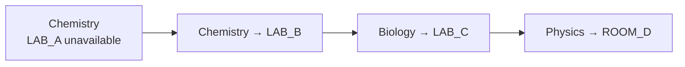
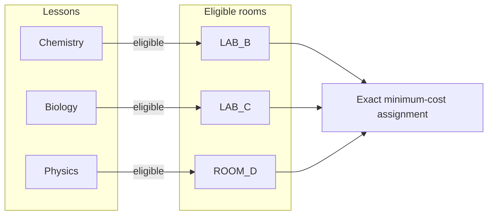

# ClassShift

> **When a classroom goes offline, repair the schedule—not the whole school day.**

ClassShift is an exact-optimization decision-support tool for recovering room assignments after a classroom becomes unavailable. It considers every lesson in the affected period—not only the lesson that lost its room—and finds a constraint-valid recovery with the minimum number of room changes. The proposed plan is independently validated and presented for human review; it is never published automatically.

## The problem

A room outage looks local until it is not. Moving the directly affected lesson may appear impossible even though a valid recovery exists after several lessons change rooms together.

ClassShift addresses that operational gap. It preserves lesson time, period, teacher, class size, identity, and requirements; only room assignments may change.

## The key insight

**A direct move failing does not mean that a global recovery is impossible.**

If Chemistry loses `LAB_A`, it may fit in `LAB_B`. But Biology already uses `LAB_B`; Biology may fit in `LAB_C`, which Physics currently uses; and Physics may fit in `ROOM_D`. The valid recovery is a chain:



| Lesson | Recovery |
|---|---|
| Chemistry | `LAB_A → LAB_B` |
| Biology | `LAB_B → LAB_C` |
| Physics | `LAB_C → ROOM_D` |

A tool that searches only for a new room for Chemistry would miss this solution. ClassShift instead re-solves the room assignment for the entire affected period.

## How ClassShift works

For each affected period, ClassShift builds a graph of lessons and the rooms they are eligible to use. It then uses exact min-cost-flow optimization to choose one room for every lesson while keeping each room unique within that period.



The result is the smallest possible set of room moves under the modeled hard constraints. For the full contract, see [`SPEC.md`](SPEC.md).

## System architecture


The optimizer proposes an assignment. A separate validator re-checks the complete proposal before it can be returned as successful. The human administrator remains the final operational decision-maker.

## Optimization model

Each affected period is solved independently as a bipartite assignment problem:

- left side: every lesson in that period;
- right side: rooms;
- an edge exists only when the room satisfies every hard constraint for that lesson;
- each lesson receives exactly one room and each room receives at most one lesson.

An eligible original-room edge has cost `0`; an eligible different-room edge has cost `1`.

`minimize Σ move(lesson)`

where `move(lesson) = 0` when it stays in its original room and `1` when it moves. Minimizing total cost therefore minimizes the number of room changes. `OPTIMAL` is returned only after OR-Tools proves an optimum and independent validation accepts the proposal.

## Hard constraints

| Constraint | Rule |
|---|---|
| Availability | Disabled or unavailable rooms cannot be assigned in the affected period. |
| Capacity | `room.capacity >= lesson.student_count` |
| Features | Every required lesson feature must be present in the room. |
| Step-free metadata | `VERIFIED` is required when a lesson needs it. |
| Locks | A locked lesson must remain in its original room. |
| Room uniqueness | At most one lesson may use a room per period. |
| Time | Lesson time and period never change. |

`UNKNOWN` step-free metadata is not treated as verified. These checks apply to supplied scheduling metadata and are not a claim of real-world accessibility or legal compliance.

## Trust, validation, and failure handling

ClassShift uses three complementary layers:

1. **Strict input validation** rejects malformed requests and invalid baseline timetables before optimization.
2. **Exact optimization** uses OR-Tools to find a complete minimum-move assignment or determine that none exists.
3. **Independent solution validation** checks every returned assignment again: lesson identity, period, room availability, capacity, features, step-free metadata, locks, double booking, and reported move count.

The validator does not use candidate generation as its correctness authority. Structured assignment records are preserved until validation so duplicate proposals and period mutation can be detected.

**ClassShift does not invent a schedule when the constraints cannot be satisfied.**

| Situation | Public status |
|---|---|
| Valid baseline, but no complete recovery | `INFEASIBLE` |
| Malformed request or invalid baseline | `INVALID_INPUT` |
| Solver cannot establish an expected outcome | `SOLVER_ERROR` |
| Optimizer proposal fails independent validation | `VALIDATOR_FAILURE` |
| Unexpected trusted application failure | `INTERNAL_ERROR` |

## Demo

### Successful recovery

1. Open **Monday · Period 3**.
2. Mark **Science Lab A** unavailable.
3. Preview the directly affected lesson.
4. Request recovery.
5. Review the three-step relocation chain.

Expected result:

```text
Chemistry   LAB_A → LAB_B
Biology     LAB_B → LAB_C
Physics     LAB_C → ROOM_D

3 room changes
0 time changes
```

### Genuine infeasibility

1. Open **Monday · Period 1**.
2. Mark `ART_1` unavailable.
3. Request recovery.

Art 9 requires the synthetic `art_sink` feature and has no valid replacement. ClassShift returns `INFEASIBLE` rather than relaxing a hard constraint.

## Technology stack

| Layer | Technology |
|---|---|
| Optimization | Google OR-Tools 9.15.x |
| Backend | Python 3.11 + Flask 3.1.x |
| Serving | Waitress 3.x |
| Frontend | Vanilla HTML, CSS, and JavaScript |
| Testing | pytest |
| Verification | Independent brute-force oracle, differential and property tests |

## Getting started

### Requirements

- Python 3.11

### Install

Windows PowerShell:

```powershell
py -3.11 -m venv .venv
.\.venv\Scripts\Activate.ps1
python -m pip install -r requirements.txt
```

macOS/Linux:

```bash
python3.11 -m venv .venv
source .venv/bin/activate
python -m pip install -r requirements.txt
```

### Run

Serve the local demo with Waitress:

```bash
waitress-serve --listen=127.0.0.1:8000 app:app
```

Open <http://127.0.0.1:8000>.

For development only, `python app.py` starts Flask on `127.0.0.1:5000`.

### Test

```bash
pytest -q
python scripts/verify_release.py
```

## API

| Endpoint | Purpose |
|---|---|
| `GET /` | Serves the administrator interface. |
| `GET /api/demo` | Returns the public synthetic demo timetable. |
| `POST /api/recover` | Requests recovery for selected room outages. |

Example request:

```json
{
  "outages": [
    {
      "room_id": "LAB_A",
      "period_ids": ["MON_P3"]
    }
  ]
}
```

Successful recovery and infeasibility responses use HTTP `200`; invalid requests use `400`. Unexpected solver, validator, or trusted application errors use `500` with generic public messages.

## Verification and evidence

The RC8 release records:

- **171** Python tests passed;
- **34** mandatory release-critical nodes passed;
- real OR-Tools 9.15.6755 execution;
- **16** measured synthetic benchmark cases across dense, sparse, bottleneck, and near-infeasible profiles;
- a real Waitress API smoke covering the primary recovery, genuine infeasibility, invalid input, and wrong content type.

Verification also includes golden fixtures, OR-Tools-versus-independent-oracle differential checks, metamorphic/property tests, validator-corruption tests, bundled release probes, and release-integrity checks. See [`evidence/final/`](evidence/final/) for the recorded RC8 evidence.

The benchmark records validation, candidate-generation, solver, validator, and synthetic pipeline timings. `pipeline_total_ms` is not HTTP latency and should not be interpreted as one.

## Data and privacy

All bundled data is synthetic. It contains no student names, real school records, accounts, secrets, or personally identifiable information. Demo data is strictly parsed and serialized through an explicit public-field representation rather than exposing arbitrary raw JSON.

## Accessibility and frontend robustness

The interface includes semantic controls, keyboard operation, visible focus indicators, text plus color for state, keyboard-focusable table regions, a responsive narrow layout, and reduced-motion-safe behavior. Request-generation tokens and `AbortController` suppress stale responses after a changed or reset selection. Dynamic content uses safe DOM insertion through `textContent` rather than HTML-string sinks.

These are implementation measures, not formal accessibility certification.

## Project scope and limitations

ClassShift deliberately solves a narrow recovery problem rather than generating an entire timetable. It changes room assignments only; it does not change lesson time, period, teacher, lesson identity, student count, or requirements.

It does not automatically publish changes and does not model teacher availability, walking distance, fairness, portable equipment, cross-period continuity, notifications, accounts, databases, or real-school data. Periods are solved independently because this focused scope has no cross-period constraints.

## AI disclosure

AI tools assisted development, review, and testing. No LLM participates in runtime recovery or solution validation. See [`AI_USAGE.md`](AI_USAGE.md).

## Repository structure

```text
classshift/
├── classshift/              # domain, validation, optimization, service
├── data/                    # synthetic demo timetable
├── fixtures/                # deterministic recovery scenarios
├── scripts/                 # oracle, benchmark, verification, browser tools
├── static/                  # frontend assets
├── templates/               # Flask templates
├── tests/                   # unit, API, property, and integrity tests
├── evidence/
│   ├── final/               # authoritative RC8 evidence
│   └── history/             # preserved verification history
├── app.py
├── SPEC.md
├── AI_USAGE.md
└── requirements.txt
```

## License

[MIT](LICENSE)
